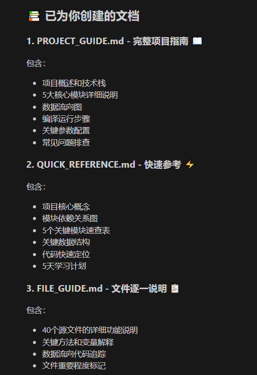
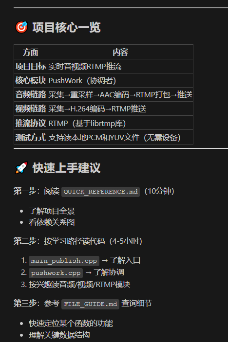
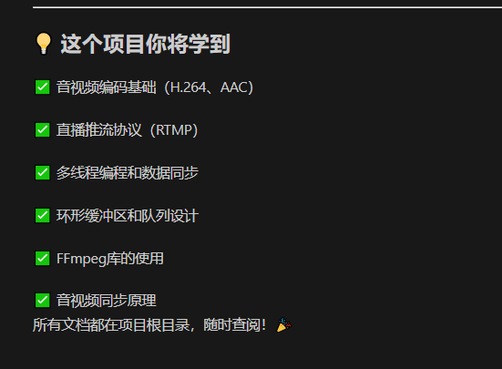

# RTMP 推流项目指南

## 📋 项目概述
这是一个基于 Qt + FFmpeg + librtmp 的 **RTMP 推流应用**，支持音视频实时采集、编码、封装和推流到RTMP服务器。

**开发环境**：
- 平台：Windows 10
- 编译环境：Qt 5.10.1 + MSVC 2015
- FFmpeg 版本：4.2.1
- SDL2 用于视频显示

---

## 📦 项目模块分析

### 1. **核心推流模块** (Core)
#### `PushWork` - 推流工作协调器
- **文件**：`pushwork.h/cpp`
- **功能**：整个推流流程的主控类，负责初始化和协调所有子模块
- **主要职责**：
  - 管理音频采集→重采样→编码→RTMP打包 的完整链路
  - 管理视频采集→编码→RTMP推送 的完整链路
  - 配置参数管理（Properties）
  - 回调函数处理

**入口代码示例**（来自 `main_publish.cpp`）：
```cpp
PushWork pushwork;
Properties properties;
// 配置音频、视频参数
properties.SetProperty("audio_test", 1);        // 使用测试PCM文件
properties.SetProperty("video_test", 1);        // 使用测试YUV文件
properties.SetProperty("rtmp_url", "rtmp://...");
pushwork.Init(properties);
pushwork.Loop();  // 启动推流循环
```

---

### 2. **音频处理链路** (Audio)

#### 2.1 音频采集 - `AudioCapturer`
- **文件**：`audiocapturer.h/cpp`
- **功能**：采集音频数据（麦克风或PCM文件）
- **关键方法**：
  - `Init(properties)`：初始化采集器
  - `Loop()`：在独立线程中循环采集
  - `AddCallback()`：设置PCM数据回调函数
- **支持两种模式**：
  - **实时模式**：从麦克风实时采集
  - **测试模式**：从本地PCM文件读取（用于开发调试）

#### 2.2 音频重采样 - `AudioResampler`
- **文件**：`audioresample.h/cpp`
- **功能**：转换PCM采样格式和采样率（使用FFmpeg的SWResample库）
- **场景**：
  - 麦克风采样率可能是44.1kHz，而编码器需要48kHz
  - 将采样格式从S16转换为浮点数等

#### 2.3 AAC音频编码 - `AACEncoder`
- **文件**：`aacencoder.h/cpp`
- **功能**：将PCM编码为AAC格式
- **关键功能**：
  - 支持多种采样率（8000Hz - 96000Hz）
  - 生成ADTS头（AAC标准格式）
  - 返回SPS/PPS配置数据

#### 2.4 AAC RTMP打包 - `AACRTMPPackager`
- **文件**：`aacrtmppackager.h/cpp`
- **功能**：将AAC编码数据打包成RTMP格式，发送给RTMP推流器

---

### 3. **视频处理链路** (Video)

#### 3.1 视频采集 - `VideoCapturer`
- **文件**：`videocapturer.h/cpp`
- **功能**：采集视频数据（桌面截屏或YUV文件）
- **关键配置**：
  - 分辨率（desktop_width × desktop_height）
  - 帧率（fps）
  - 像素格式（缺省 YUV420P）
- **支持两种模式**：
  - **实时模式**：从桌面/屏幕采集
  - **测试模式**：从本地YUV文件读取

#### 3.2 H.264视频编码 - `H264Encoder`
- **文件**：`h264encoder.h/cpp`
- **功能**：将YUV视频帧编码为H.264
- **关键功能**：
  - 提取SPS/PPS信息（视频配置数据）
  - 控制GOP（I帧间隔）
  - 设置比特率、B帧数等编码参数
- **输出**：H.264 NALU单元

#### 3.3 图像缩放 - `ImageScale`
- **文件**：`imagescale.h/cpp`
- **功能**：调整视频分辨率（使用FFmpeg的libswscale库）

#### 3.4 视频显示 - `VideoOutSDL`
- **文件**：`videooutsdl.h/cpp`
- **功能**：使用SDL2库实时显示推流的画面（debug用）
- **应用场景**：对比推流延迟和拉流延迟

---

### 4. **RTMP协议处理** (RTMP)

#### 4.1 RTMP基础类 - `RTMPBase`
- **文件**：`rtmpbase.h/cpp`
- **功能**：RTMP连接管理
- **关键方法**：
  - `Connect(url)`：连接到RTMP服务器
  - `Disconnect()`：断开连接
  - `IsConnect()`：检查连接状态

#### 4.2 RTMP推流器 - `RTMPPusher`
- **文件**：`rtmppusher.h/cpp`
- **功能**：发送H.264视频和AAC音频到RTMP服务器
- **关键职责**：
  - 发送Metadata（视频宽高、帧率、音频信息等）
  - 发送视频序列头（SPS/PPS）
  - 发送音频配置（AudioSpecificConfig）
  - 发送编码后的视频和音频数据
- **消息处理**：
  - `RTMPPUSHER_MES_H264_DATA`：H.264数据
  - `RTMPPUSHER_MES_AAC_DATA`：AAC音频数据

#### 4.3 librtmp库
- **路径**：`librtmp/` 目录
- **功能**：底层RTMP协议实现
- **核心文件**：
  - `rtmp.h/c`：RTMP协议核心
  - `amf.h/c`：AMF数据格式处理
  - `handshake.h/c`：RTMP握手协议

---

### 5. **辅助工具模块** (Utilities)

#### 线程和循环管理
- **`Looper`**（`looper.h/cpp`）：基础线程循环类
- **`CommonLooper`**（`commonlooper.h/cpp`）：通用循环基类
- **`NaluLoop`**（`naluloop.h/cpp`）：NALU数据的线程安全处理

#### 同步和时间管理
- **`AVSync`**（`avsync.h/cpp`）：音视频同步控制
- **`AVTimeBase`**（`avtimebase.h/cpp`）：时间基准管理
- **`AvPublishTime`**（`avpublishtime.h/cpp`）：发布时间戳管理
- **`TimeUtil`**（`timeutil.h`）：时间工具函数

#### 数据结构
- **`RingBuffer`**（`ringbuffer.h`）：环形缓冲区（线程安全的队列）
- **`MediaBase`**（`mediabase.h/cpp`）：基础数据结构和属性管理
- **`Semaphore`**（`semaphore.h`）：信号量同步

#### 日志
- **`DLog`**（`dlog.h/cpp`）：调试日志系统

---

## 🔄 数据流向图

```
音频流：
麦克风/PCM文件 → AudioCapturer → AudioResampler
  → AACEncoder → AACRTMPPackager → RTMPPusher → RTMP服务器
                                  ↓
视频流：                    Metadata+SPS/PPS
桌面/YUV文件 → VideoCapturer → H264Encoder
  → RTMPPusher → RTMP服务器

显示（debug）：
  → VideoOutSDL（显示推流画面）
```

---

## 🚀 如何上手项目

### 第一步：理解整体架构
1. **从主入口开始**：阅读 `main_publish.cpp`
   - 了解如何初始化 `PushWork`
   - 配置各项参数

2. **理解PushWork工作流**：阅读 `pushwork.h/cpp`
   - 看 `Init()` 方法如何初始化各个模块
   - 看 `Loop()` 如何启动推流

### 第二步：分模块学习

#### 学习音频处理（推荐优先）
1. `AudioCapturer` - 了解采集流程
2. `AudioResampler` - 了解格式转换
3. `AACEncoder` - 了解编码流程
4. `AACRTMPPackager` - 了解打包格式

#### 学习视频处理
1. `VideoCapturer` - 了解采集流程
2. `H264Encoder` - 了解编码流程
3. `VideoOutSDL` - 了解显示（可选）

#### 学习RTMP协议
1. `RTMPBase` - 了解连接管理
2. `RTMPPusher` - 了解数据发送流程
3. `librtmp` - 了解底层RTMP实现（高级）

### 第三步：本地编译运行

#### 环境准备
```bash
# 1. 安装依赖库（已包含在项目中）
#    - ffmpeg-4.2.1-win32-dev（在项目目录中）
#    - SDL2（在项目目录中）

# 2. 准备测试数据文件
#    将以下文件放到 build 目录：
#    - buweishui_48000_2_s16le.pcm  (音频)
#    - 720x480_25fps_420p.yuv        (视频)
```

#### 生成测试数据（如没有的话）
```bash
# 提取PCM数据
ffmpeg -i buweishui.mp3 -ar 48000 -ac 2 -f s16le buweishui_48000_2_s16le.pcm

# 提取YUV数据
ffmpeg -i 720x480_25fps.mp4 -an -c:v rawvideo -pix_fmt yuv420p 720x480_25fps_420p.yuv
```

#### 编译和运行
```bash
# 在 Qt Creator 中打开 rtmp-publish.pro
# 选择编译器：MSVC2015 32-bit
# 点击编译和运行

# 运行后会：
# 1. 读取PCM和YUV测试文件
# 2. 实时编码
# 3. 连接到RTMP服务器推流
# 4. 如果启用debug模式，显示推流画面
```

---

## 🔧 关键配置参数

### 音频配置
```cpp
properties.SetProperty("audio_test", 1);              // 测试模式
properties.SetProperty("input_pcm_name", "xxx.pcm");  // 输入文件
properties.SetProperty("mic_sample_rate", 48000);     // 采样率
properties.SetProperty("mic_channels", 2);            // 通道数
properties.SetProperty("audio_bitrate", 64*1024);     // 编码码率
```

### 视频配置
```cpp
properties.SetProperty("video_test", 1);              // 测试模式
properties.SetProperty("input_yuv_name", "xxx.yuv");  // 输入文件
properties.SetProperty("desktop_width", 720);         // 宽度
properties.SetProperty("desktop_height", 480);        // 高度
properties.SetProperty("desktop_fps", 25);            // 帧率
properties.SetProperty("video_bitrate", 512*1024);    // 编码码率
```

### RTMP配置
```cpp
properties.SetProperty("rtmp_url", "rtmp://...");     // 推流地址
properties.SetProperty("rtmp_debug", 1);              // 是否显示推流画面
```

---

## 📝 代码阅读建议

### 初级：快速了解（1-2小时）
- [ ] 阅读 `main_publish.cpp` - 理解主流程
- [ ] 阅读 `pushwork.h/cpp` - 理解整体架构
- [ ] 浏览各模块的头文件（`.h`）

### 中级：深入学习（3-5小时）
- [ ] 详细阅读各个模块的实现（`.cpp`）
- [ ] 理解音视频编码流程
- [ ] 理解RTMP协议数据发送过程
- [ ] 理解线程和同步机制

### 高级：代码优化（按需）
- [ ] 研究librtmp库的细节
- [ ] 分析性能瓶颈
- [ ] 理解音视频同步机制

---

## 🐛 常见问题排查

### 1. 推流连接失败
- 检查RTMP服务器地址是否正确
- 检查网络连接
- 查看 `rtmp_push.log` 日志文件

### 2. 音视频不同步
- 检查 `AVSync` 和 `AvPublishTime` 的实现
- 调整各个模块的缓冲区大小

### 3. 编码效率低
- 调整视频码率 `video_bitrate`
- 调整音频码率 `audio_bitrate`
- 检查CPU使用率

### 4. 显示画面延迟大
- 启用 `rtmp_debug=1` 查看推流画面
- 对比推流画面和拉流画面的延迟
- 查看 `VideoOutSDL` 的实现

---

## 📚 相关资源

### FFmpeg 文档
- libavcodec - 音视频编码
- libswresample - 音频重采样
- libswscale - 视频缩放

### RTMP 协议
- Adobe RTMP 规范
- librtmp 源码注释

### Qt 多线程
- QThread 使用
- 信号槽机制（本项目未使用Qt信号槽，使用回调函数）

---

## 📄 文件清单

### 核心推流
- `pushwork.h/cpp` - 推流工作协调器
- `main_publish.cpp` - 应用入口

### 音频处理
- `audiocapturer.h/cpp` - 音频采集
- `audioresample.h/cpp` - 音频重采样
- `aacencoder.h/cpp` - AAC编码
- `aacrtmppackager.h/cpp` - RTMP打包

### 视频处理
- `videocapturer.h/cpp` - 视频采集
- `h264encoder.h/cpp` - H.264编码
- `imagescale.h/cpp` - 图像缩放
- `videooutsdl.h/cpp` - SDL显示

### RTMP协议
- `rtmpbase.h/cpp` - RTMP基础
- `rtmppusher.h/cpp` - RTMP推流
- `librtmp/*` - 底层库

### 辅助工具
- `commonlooper.h/cpp` - 循环基类
- `looper.h/cpp` - 线程循环
- `naluloop.h/cpp` - NALU处理
- `avsync.h/cpp` - 音视频同步
- `avtimebase.h/cpp` - 时间管理
- `mediabase.h/cpp` - 基础结构
- `dlog.h/cpp` - 日志
- 其他工具类

---

## 🎯 学习建议

1. **不要直接看librtmp库** - 先从应用层理解
2. **关注回调机制** - 项目使用回调函数而不是信号槽
3. **理解缓冲区** - RingBuffer是关键数据结构
4. **学习线程安全** - 多个线程之间的数据同步很重要
5. **逐步修改代码** - 从简单的参数改动开始尝试

祝你学习愉快！🎉








